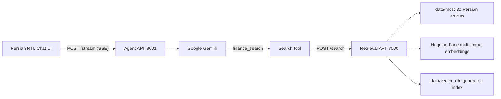

# Persian Finance & Crypto Assistant

A local, **Persian-language** Q&A assistant for finance and cryptocurrency education. It uses a curated local Markdown knowledge base, multilingual Hugging Face embeddings, FAISS semantic search, Google Gemini, and a right-to-left browser chat interface.

> The assistant is educational. It does not provide personalised investment, tax, or legal advice, and it has no live prices, current news, or trading-account data.

## Features

- Persian RTL chat interface.
- 30 local Persian Markdown articles covering technical analysis, fundamental analysis, risk management, markets, blockchain, and crypto.
- Multilingual semantic retrieval using `sentence-transformers/paraphrase-multilingual-MiniLM-L12-v2` and FAISS.
- Gemini agent that searches the local knowledge base through the `finance_search` tool when evidence is useful.
- Server-Sent Events (SSE) response streaming and browser-side chat history.
- Lazy indexing: the first search creates the local vector index; subsequent searches load it.

## Architecture



## Project structure

```text
assessment/
├── data/
│   └── mds/                     # 30 Persian finance and crypto articles
├── src/
│   ├── agent/                   # Gemini orchestration and finance_search tool
│   ├── frontend/                # Persian RTL browser chat UI
│   └── retrieval/               # Markdown indexing and semantic search API
├── utils/                       # Embedding and retrieval smoke tests
├── pyproject.toml
└── uv.lock
```

`data/vector_db/` is intentionally not versioned. It is created automatically from `data/mds/` on the first retrieval request.

## Requirements

- Python 3.12 or newer.
- [uv](https://docs.astral.sh/uv/).
- A Google AI Studio API key.
- A Hugging Face API token with access to the embedding endpoint.
- Network access to Google Gemini and Hugging Face.

## Configuration

Create a `.env` file in the project root:

```env
GEMINI_API_KEY=your_google_ai_studio_key
GEMINI_MODEL=gemini-2.5-flash-lite
HF_TOKEN=your_huggingface_token
EMBEDDING_MODEL=sentence-transformers/paraphrase-multilingual-MiniLM-L12-v2
RETRIEVAL_ENDPOINT=http://127.0.0.1:8000/search
```

`GEMINI_MODEL` is configurable because available models depend on the Google project, API key, region, and account tier.

`EMBEDDING_MODEL` is configurable to make embedding-model experiments easy. Whenever it changes, delete `data/vector_db/` while the services are stopped so the knowledge base is indexed again with the new model.


## Install

```powershell
uv sync
```

## Run the application

Start the retrieval service in one PowerShell terminal:

```powershell
uv run uvicorn src.retrieval.main:app --reload --port 8000
```

Start the agent service in a second PowerShell terminal:

```powershell
uv run uvicorn src.agent.main:app --reload --port 8001
```

Then open [http://127.0.0.1:8001/](http://127.0.0.1:8001/) in a browser.

The first finance search builds `data/vector_db/`, so it can take longer than later searches. To rebuild after editing the Markdown articles, stop the services, delete only `data/vector_db/`, and run a search again.

## APIs

### Retrieval: `POST /search`

```powershell
Invoke-RestMethod `
  -Method Post `
  -Uri http://127.0.0.1:8000/search `
  -ContentType "application/json" `
  -Body '{"query":"شاخص RSI چگونه برای شناسایی اشباع خرید استفاده می‌شود؟","k":5}'
```

It returns matching Markdown chunks, their source filenames, and FAISS distance scores. Scores are relative ranking signals, not confidence percentages or trading signals.

### Agent: `POST /stream`

```powershell
curl.exe -N `
  -X POST http://127.0.0.1:8001/stream `
  -H "Content-Type: application/json" `
  --data-raw '{"query":"تحلیل تکنیکال و فاندامنتال چه تفاوتی دارند؟","history":[]}'
```

The endpoint streams SSE events, including a `tool_start` event when the agent searches the finance knowledge base.

## Optional smoke tests

```powershell
uv run python utils\hf_embedding_test.py
uv run python utils\embedding_endpoint_test.py
```

Run the second command only after both services are running.

## Security notes

- Keep `.env` private; it is ignored by Git.
- API keys stay on the server and are not sent to the browser.
- Load the generated FAISS index only from this trusted local project directory.
- Do not place private wallet seed phrases, account credentials, or sensitive financial information in chat messages or knowledge-base articles.
